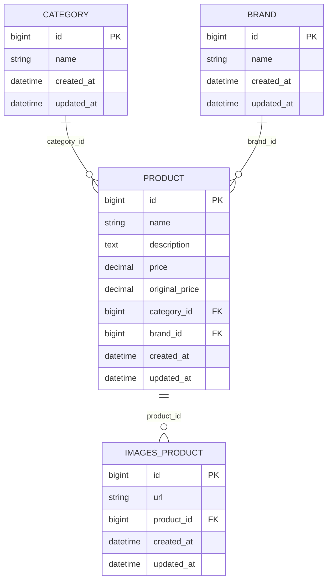

# TechStore E-commerce Backend

Laravel 12 project that powers the admin console and public catalog for TechStore, a demo e-commerce focused on electronics. It provides product/category/brand management, seeded data, admin workflow, and customer-facing browsing with category filters.

---

## Tabla de contenidos

1. [Arquitectura general](#arquitectura-general)
2. [Requisitos del sistema](#requisitos-del-sistema)
3. [Instalación y puesta en marcha](#instalación-y-puesta-en-marcha)
4. [Credenciales por defecto](#credenciales-por-defecto)
5. [Flujo funcional](#flujo-funcional)
6. [Manual de usuario](#manual-de-usuario)
7. [Pruebas y calidad](#pruebas-y-calidad)
8. [Diagrama de datos](#diagrama-de-datos)
9. [Estructura del repositorio](#estructura-del-repositorio)

---

## Arquitectura general

- **Laravel 12** con PHP 8.2.
- Persistencia mediante migraciones y seeders (`category`, `brand`, `product`, `images_product`).
- **Blade** para vistas públicas y de administración.
- **Factories** para generar datos realistas (20 categorías, 20 marcas y 1000 productos).
- Admin panel protegido con middleware `auth` + `admin`.
- Paginación con Bootstrap (`Paginator::useBootstrap()`).
- Workflow completo de CRUD parcial (crear/listar/eliminar) para products, categories y brands.
- Tests de feature cubriendo listados, formularios, filtros y seeders (`php artisan test`).

---

## Requisitos del sistema

- PHP ≥ 8.2 con extensiones típicas de Laravel (ctype, curl, dom, fileinfo, json, mbstring, openssl, pdo, tokenizer, xml).
- Composer ≥ 2.6.
- Node.js (opcional para Vite, no necesario para este demo).
- MySQL/MariaDB o SQLite (el repo se apoya en SQLite en testing).

---

## Instalación y puesta en marcha

```bash
git clone <repo>
cd ecommerce
cp .env.example .env   # ajusta credenciales de BD si usas MySQL
composer install
php artisan key:generate
php artisan migrate:fresh --seed
php artisan serve
```

- Accede a http://127.0.0.1:8000/ para la landing pública.
- Accede a http://127.0.0.1:8000/admin/products como administrador (ver credenciales abajo).

---

## Credenciales por defecto

Seeder `AdminUserSeeder` crea un administrador:

| Campo    | Valor                  |
|----------|------------------------|
| Email    | `admin@techstore.test` |
| Password | `password`             |

> Cambia la contraseña en producción. Puedes crear más admins ejecutando `php artisan tinker` y forzando `is_admin = true`.

---

## Flujo funcional

1. **Landing / Catálogo** (`/` o `/home` si estás logueado):
   - Filtro por categoría (`?category_id=...`).
   - Tarjetas de producto con marca/categoría y placeholder interno.
2. **Productos públicos** (`/products`):
   - Buscador (`q`) + filtro por categoría (`category_id`).
   - Lista paginada, sin datos dummy.
3. **Zona Admin** (`/admin/...`):
   - **Products**: tabla con acciones de eliminar, formulario de creación con selects y validaciones.
   - **Categories/Brands**: tablas paginadas + eliminación + formulario de alta.
   - Sidebar del layout admin con enlaces.
4. **Autenticación**:
   - Rutas de Laravel UI (`Auth::routes()`).
   - Navbar público muestra botón “Panel Admin” solo para `is_admin = true`.

---

## Manual de usuario

### Usuario público

1. Ingresa a `/` para ver la landing y el catálogo.
2. Usa el select de categorías para filtrar.
3. Haz clic en “Productos” (navbar) para ver el listado completo con buscador.
4. Para registro/login, usa los botones del hero o la navbar (solo visibles si no has iniciado sesión).

### Usuario autenticado (cliente)

1. Después del login (`/login`) serás redirigido a `/home` con el mismo catálogo pero disponible solo para usuarios autenticados.
2. Puedes navegar de vuelta al home público o cerrar sesión desde la navbar.

### Administrador

1. Inicia sesión con el admin por defecto.
2. Desde la navbar, verás “Panel Admin” (solo si eres admin) que lleva a `/admin/products`.
3. En el panel puedes:
   - Listar productos (paginación, eliminación, link para crear).
   - Crear producto con selects de Category/Brand.
   - Listar y eliminar categorías/marcas y crear nuevas.
4. Todos los formularios tienen validaciones en servidor (price numeric, exists en BD, strings con longitud).

---

## Pruebas y calidad

```bash
php artisan test
```

Incluye:

- `AdminProductControllerTest`: create/store/validations/list view.
- `AdminProductTableTest`, `AdminCategoryTableTest`, `AdminBrandTableTest`: listados, paginación, eliminación.
- `DatabaseStructureTest`, `ProductRelationsTest`, `SeederTest`: estructura, relaciones y seeding.
- `HomeCatalogTest`: filtro público por categoría.
- `ExampleTest` ajustado con `RefreshDatabase`.

---

## Diagrama de datos



---

## Estructura del repositorio

```
├─ app/
│  ├─ Http/Controllers/        # Home, Product, admin controllers
│  ├─ Http/Middleware/EnsureUserIsAdmin.php
│  └─ Models/                  # Product, Category, Brand, User
├─ config/catalog.php          # Listas predefinidas de categorías/marcas
├─ database/
│  ├─ factories/               # Product/Category/Brand/User factories
│  ├─ migrations/              # Tablas category, brand, product, images_product, users...
│  └─ seeders/                 # CategorySeeder, BrandSeeder, ProductSeeder, AdminUserSeeder
├─ public/assets/              # CSS/JS/IMG para el panel y placeholders
├─ resources/views/
│  ├─ admin/                   # Layout + vistas de products/categories/brands
│  ├─ layouts/app.blade.php    # Navbar y layout general
│  ├─ products/                # Listing, detail, component
│  ├─ home.blade.php           # Dashboard tras login
│  └─ welcome.blade.php        # Landing pública
├─ routes/web.php              # Rutas públicas + admin + Auth
├─ tests/Feature/              # Cobertura funcional
├─ tests/Unit/                 # Tests base
└─ README.md                   # Este documento
```

---

## Siguientes pasos sugeridos

- Añadir edición (update) para productos/categorías/marcas.
- Integrar almacenamiento real de imágenes (`images_product`).
- Conectar con un carrito / checkout real.
- Añadir roles/permissions avanzados si crece el equipo.

¡Disfruta TechStore! cualquier mejora o issue es bienvenida.
